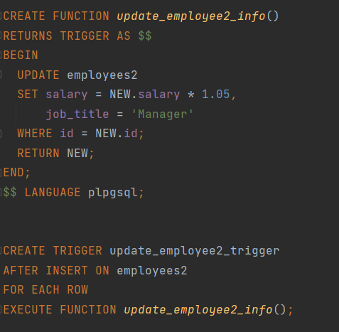
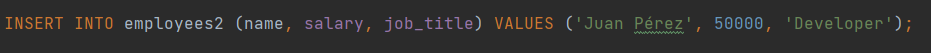
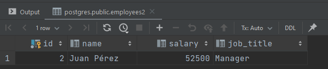

#PL/PGSQL
---

Para empezar este commit creamo la tabla correspondiente para poder trabajar con ello 

---

Para poder usar nuestro trigger creamo una funcion y esta la llamaremos desde el trigger

---

Ahora para comprobar que funciona el trigger hacemos un insert en la tabla y despues imprimiremos el resultado para mirar si funciona

---

Como podemos ver el salario se ha incrementado y el job ha cambiado 

---

